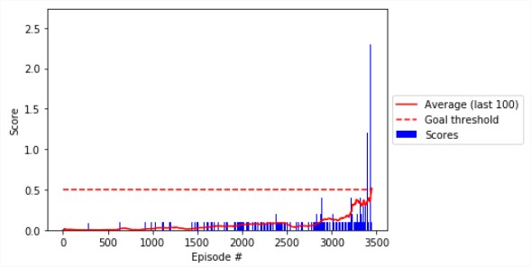

# The learning algorithm
We used the Multi-Agent Deep Deterministic Policy Grandient — MADDPG — algorithm to solve the environment ([original paper](https://papers.nips.cc/paper/7217-multi-agent-actor-critic-for-mixed-cooperative-competitive-environments.pdf))

This algorithm was first introduced by Ryan Lowe and Yi Wu in . It was designed to solve problems of reinforcement learning for multiple agents in mixed cooperative-competitive environments.

Each agent follows the Deep Deterministic Policy Gradient (DDPG) algorithm to learn. Introduced by Timothy P. Lillicrap and Jonathan J. Hunt, it was designed to solve problems of reinforcement learning for continuous and high dimensional action spaces, like our case. 
This algorithm is a model-free, off-policy actor-critic algorithm. It uses a replay buffer and soft target updates. Let's describe this features:

**Model-free**
We use the neural network to directly output the policy for a given state.

**Off-policy**
The algorithm does not necessarily follow the optimal policy in order to find the optimal policy. In our case,  the agent adds noise to the policy before acting.

**Actor-critic**
The model train 2 networks simultaneously: the actor network to output the policy and the critic network to output a value function, such as the action-value function.

**Replay buffer**
To avoid effect of unwanted correlation existing in past actions, this algorithm uses a replay buffer for storing experiences (each experience is a tuple of states, actions, the rewards and the next states for a given time step). So instead of learn each iteration, it first stores a lot of experiences, them the algorithm take randomly and in random order some of the stored experiences in order to train the two networks. It has a limit of memory for storing experiences, so when it reaches the limit, the first ones are being discarded and new experiences are being added in the memory position.

**Soft Updates**
In order to improve stability of learning, we use the "soft" target updates, instead of simply copying the networks for the targets. That is, the target is a copy of the actor and critic networks that are updated every time step, but with a tau factor that is the proportion of the update that was from the original networks. This way the target networks are updated slowly.

# The MADDPG algorithm
This algorithm considers that only the local observations of each agent can be used by the policy. So, the inputs of the action networks of each agent are its own observation. But we use all the observations (off all agents) to train the critic networks. This way, every time an agent will act, we only use the actor network, so the agent only base its actions in this own observations, but the entire set of observations are considered to the learning process.
Each agent have own critic, so each one can have its own reward function, that may be competitive, cooperative or mixed with the strategies of other agents.

# The chosen hyper parameters
BUFFER_SIZE = int(1e6)               # max size of memory buffer
N_EPISODES = 20000                   # number of training episodes
EPISODE_MAX_T = 10000                # max timesteps each episode
BATCH_SIZE = 1024                    # size of batch
SAVE_INTERVAL = 1000                 # how many episodes to save policy
HIDDEN_NETWORK = [256, 256, 128]     # Structure of the hidden layers of the networks
LR_ACTOR = 1e-3                      # Learning rate of actor networks
LR_CRITIC = 1e-3                     # Learning rate of critic networks
ALLOW_BN = False                     # Allow Batch Normalization

NOISE = 2                            # amplitude of OU noise
NOISE_REDUCTION = 0.99995            # this slowly decreases to 0
EPISODE_PER_UPDATE = 1               # how many episodes before update

PRINT_EVERY = 100                    # how many episodes to print the medium scores
MOVING_AVERAGE_WINDOW = 100          # Size of moving average window
SIGMA = 0.1             # Ornstein-Uhlenbeck Sigma

# The model architecture for actor and critic

Both actor and critic networks are composed by (in order from input to output):
1. A linear layer with 24 inputs (the size of the states space) and 256 nodes, with Retified Linear (relu) activation function;
2. A second linear layer with 256 nodes and relu activation function.
3. A third linear layer of 128 nodes and relu activation function.
4. Another linear layer with 2 outputs (the size of the actions space). For the actor networks we add Hyperbolic Tangent Activation Function (TanH) and bound the norm of the vector to be between 0 and 10.

# Plot of rewards (Average agent score)
Algorithm skipped 3447 episodes to solve the problem.

# Ideas for Future Work
For future works, we can try:
- Different architectures for the networks, maybe more complex ones, with more layers, some batch normalization etc;
- Known strategies for improving DDPG performance, such as [Prioritized Experience Replay](https://cardwing.github.io/files/RL_course_report.pdf) and [Weight Averaging](http://www.gatsby.ucl.ac.uk/~balaji/udl-camera-ready/UDL-24.pdf)
- As stated in [this article](https://medium.com/brillio-data-science/improving-openai-multi-agent-actor-critic-rl-algorithm-27719f3cafd4), we could try to stabilize training by separeting the actions of the current agent from the input of the critic network. Thus, we would enter this actions only in second hidden layer, after the input containing all states and all other agents actions in first hidden layer.